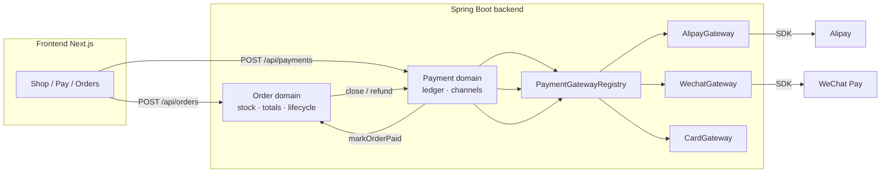
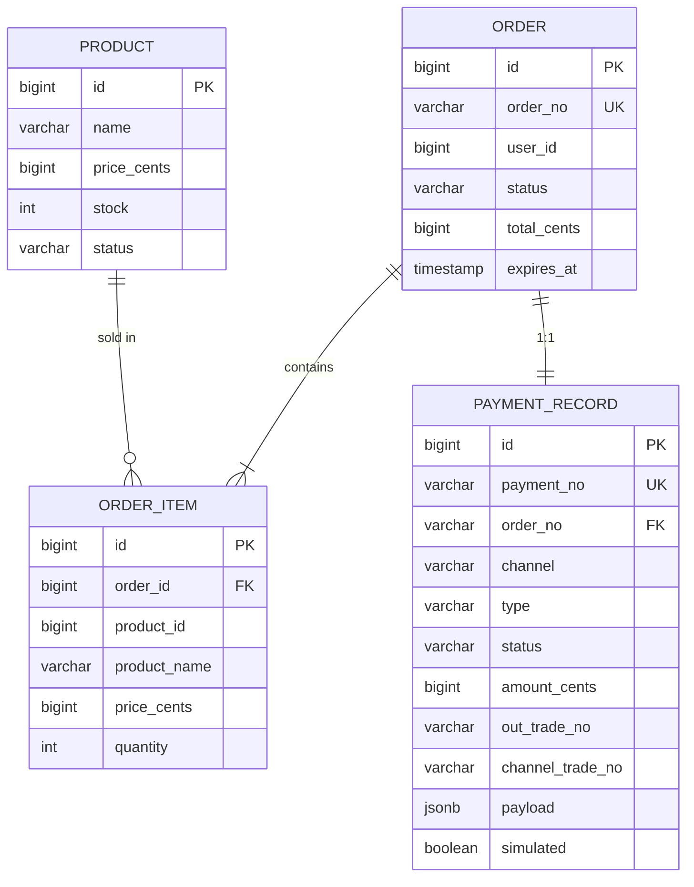
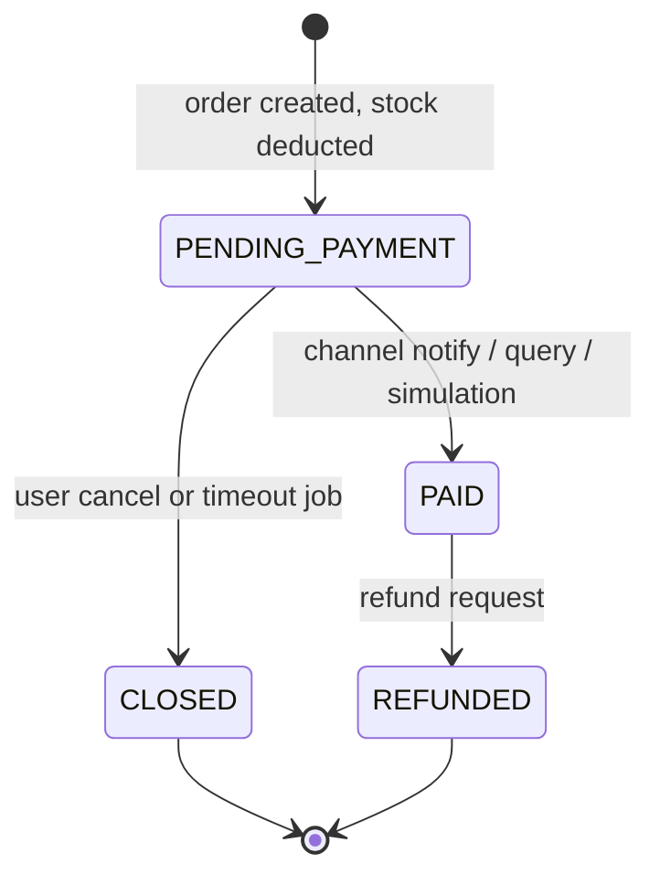
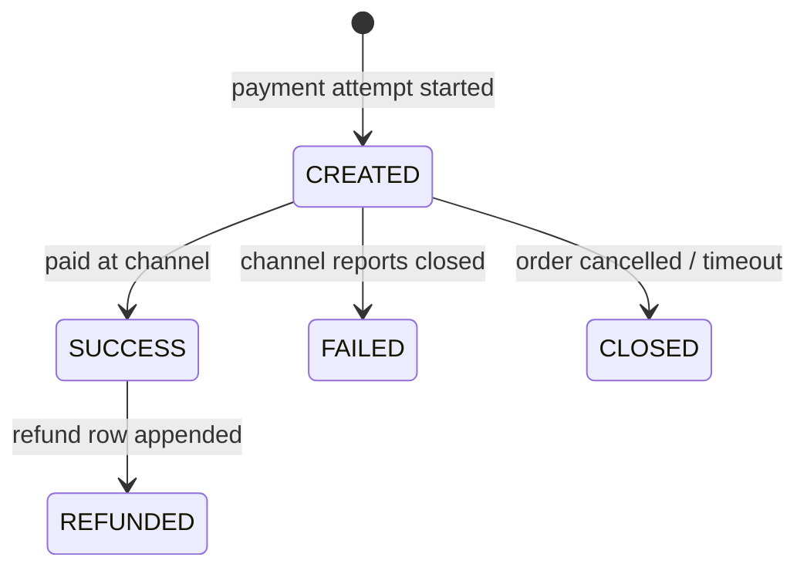

# Order · Stock · Multi-Channel Payment System — Design

> Status: **Implemented** · Scope: backend (Spring Boot) + minimal Next.js frontend

## 1. Goals

Build an end-to-end e-commerce demo flow on top of the existing `ServerDemo` stack:

1. **Products with stock** — create products, list them, restock, atomic stock deduction.
2. **Orders** — create an order for a set of products/quantities, track lifecycle
   (pending → paid → closed / refunded). **The order domain never touches payment** —
   it only owns stock, totals and lifecycle.
3. **Payments (multi-channel)** — one payment domain with a channel abstraction that
   supports **Alipay, WeChat Pay and credit card**, plus a local *simulation mode* so
   the entire flow runs without any merchant credentials.

Explicitly **out of scope** for this iteration: real auth/JWT, shipping/fulfillment,
admin UI, order splitting. These are listed as extensions in §11.

## 2. Tech stack

| Layer    | Choice                                                                 |
|----------|------------------------------------------------------------------------|
| Backend  | Spring Boot 4.1 (Java 21, Maven), JPA/Hibernate, PostgreSQL (existing) |
| Alipay   | `com.alipay.sdk:alipay-sdk-java` **4.40.272.ALL** (public-key mode)     |
| WeChat   | `com.github.wechatpay-apiv3:wechatpay-java` **0.2.17** (v3, Native pay) |
| Card     | simulated PSP adapter (swap for Stripe/Adyen later)                     |
| Frontend | Next.js 16 / React 19 (existing) — a few read-only pages + actions      |
| Money    | Stored as **cents (BIGINT)**, exposed as `BigDecimal` yuan at the API edge |

**Channel abstraction.** Every channel implements one interface:

```java
interface PaymentGateway {
    PaymentChannel channel();                    // ALIPAY | WECHAT | CARD
    GatewayCreateResult create(GatewayCreateContext ctx);
    GatewayQueryResult query(String outTradeNo);
    void close(String outTradeNo);
    void refund(String outTradeNo, long amountCents);
    boolean isSimulated();
}
```

**Simulation mode** (`payment.simulation-enabled: true` by default): gateways whose
credentials are missing (or the global flag) return a local pay page with a
"simulate pay" button, so the whole multi-channel flow is demoable with zero keys.
Set it to `false` (and configure `ALIPAY_*` / `WECHAT_*` env vars) to use the real
gateways; the card channel is always simulated until a real PSP is wired in.

## 3. Architecture overview



- **Order flow** (synchronous): `POST /api/orders` validates → atomically deducts stock →
  inserts order + snapshot items. **No payment involvement.**
- **Payment flow** (synchronous): the client picks a channel and calls `POST /api/payments`;
  the payment domain creates a ledger row and asks the channel adapter to prepare the pay
  page (`/api/payments/{paymentNo}/pay` renders channel-specific HTML).
- **Payment result** (asynchronous): channel callbacks (`/api/payments/alipay/notify`,
  `/api/payments/wechat/notify`) verify signatures and complete the payment; polling
  (`GET /api/payments/{paymentNo}`) reconciles real payments via channel query APIs and
  is the primary completion path in simulation/local dev.
- **Timeout**: a scheduled job closes expired unpaid orders, restores stock, closes payments.

## 4. Data model

### 4.1 Entities

**`Product`** (`products`)

| Field            | Type      | Notes                              |
|------------------|-----------|------------------------------------|
| id               | BIGINT PK | identity                           |
| name             | varchar   | required                           |
| price_cents      | BIGINT    | required, > 0                      |
| stock            | INT       | required, >= 0 (available)         |
| status           | enum      | `ON_SALE`, `OFF_SALE`              |

**`Order`** (`orders`) — pure commerce, no payment knowledge

| Field           | Type      | Notes                                             |
|-----------------|-----------|---------------------------------------------------|
| id              | BIGINT PK |                                                   |
| order_no        | varchar   | unique, business key (e.g. `ts + random`)         |
| user_id         | BIGINT    | demo: passed in request (no real auth)            |
| status          | enum      | `PENDING_PAYMENT` `PAID` `CLOSED` `REFUNDED`      |
| total_cents     | BIGINT    | sum of items, computed server-side                 |
| expires_at      | timestamp | = created + 15 min (payment deadline)             |
| created_at / paid_at / closed_at | timestamp |                            |

**`OrderItem`** (`order_items`)

| Field         | Type   | Notes                                            |
|---------------|--------|--------------------------------------------------|
| id            | BIGINT PK |                                                |
| order_id      | FK     |                                                  |
| product_id    | BIGINT |                                                  |
| product_name  | varchar | **snapshot** at order time                       |
| price_cents   | BIGINT | **snapshot** at order time                       |
| quantity      | INT    |                                                  |
| subtotal_cents | BIGINT | price × quantity                               |

**`PaymentRecord`** (`payment_records`) — payment-domain ledger, **decoupled from orders**

| Field            | Type     | Notes                                              |
|------------------|----------|----------------------------------------------------|
| id               | BIGINT PK|                                                    |
| payment_no       | varchar  | unique                                             |
| order_no         | varchar  | indexed, **not unique** (retries + refunds)        |
| user_id          | BIGINT   |                                                    |
| channel          | enum     | `ALIPAY` `WECHAT` `CARD`                           |
| type             | enum     | `PAYMENT` `REFUND`                                 |
| status           | enum     | `CREATED` `SUCCESS` `FAILED` `CLOSED` `REFUNDED`   |
| amount_cents     | BIGINT   |                                                    |
| out_trade_no     | varchar  | our trade ref sent to the channel (= order no)     |
| channel_trade_no | varchar  | channel txn id (alipay trade_no / wechat transaction_id) |
| payload          | jsonb    | opaque channel prep data (Alipay form / WeChat code_url) |
| simulated        | boolean  | completed via local simulation                     |
| created_at / paid_at | timestamp |                                                 |

### 4.2 ER diagram



### 4.3 Status machines





## 5. Key business rules

### 5.1 Stock consistency (the critical part)

- **Deduct on order creation** (not on payment) to prevent overselling; restore on close.
- Deduction uses a single **atomic conditional UPDATE** — no race conditions:

  ```sql
  UPDATE products SET stock = stock - :qty
  WHERE id = :id AND stock >= :qty
  ```

  If affected rows == 0 → insufficient stock → reject order.
- Order creation (deduct stock + insert order + items) happens in **one `@Transactional`**
  method in the order domain — **no payment record is created here**.
- **Restore** stock in the same transaction that closes/cancels an order. Restore is
  guarded so it runs exactly once (transition `PENDING_PAYMENT → CLOSED` only).

### 5.2 Order creation (order domain only)

1. Validate request (items non-empty, quantities > 0, product exists & `ON_SALE`).
2. For each item: atomic stock deduction (5.1). On any failure → whole order fails.
3. Compute totals server-side (never trust client-side prices; prices come from DB).
4. Persist order + items (`PENDING_PAYMENT`, `expires_at = now + 15 min`).
5. Done — the client then chooses a channel and calls `POST /api/payments`.

### 5.3 Payment creation (payment domain only)

`POST /api/payments {orderNo, channel}`:

1. Validate: order exists, `PENDING_PAYMENT`, not expired.
2. Resolve the channel adapter from the registry.
3. Create a `PaymentRecord` (`CREATED`).
4. If the adapter is simulated → mark `simulated`, no channel call.
   Else → `gateway.create(...)` stores the opaque payload (Alipay form / WeChat code_url).
5. Return `{paymentNo, payUrl}` — the browser opens `/api/payments/{paymentNo}/pay`,
   which renders channel-specific HTML (auto-submit Alipay form, WeChat QR, card form,
   or the simulation button).

### 5.4 Channel callbacks & polling

- **Alipay** `POST /api/payments/alipay/notify`: verify RSA2 signature + `app_id` +
  `total_amount` against the latest pending record; `TRADE_SUCCESS/FINISHED` → mark paid;
  `TRADE_CLOSED` → close pending. Reply plain-text `success` (else Alipay retries).
- **WeChat** `POST /api/payments/wechat/notify`: verify via official SDK
  (`NotificationParser`), reply `{"code":"SUCCESS"}`. Declines in simulation mode.
- **Polling** `GET /api/payments/{paymentNo}`: for real (non-simulated) `CREATED`
  payments, reconciles via `gateway.query` and completes when the channel reports
  `SUCCESS` — this is the primary local-dev completion path.
- `return_url` is only a UX hook — the backend never trusts it to confirm payment.

### 5.5 Order timeout (auto-close)

- `@EnableScheduling` + `@Scheduled(fixedDelay = 60s)`: select `PENDING_PAYMENT` orders
  with `expires_at < now` (pessimistic-locked query inside a transaction), then per order
  (transaction): close order, restore stock, close CREATED payment attempts, best-effort
  `gateway.close`.
- Boundary case: order expires while a notify is in flight — the compare-and-set guard
  ensures only one side wins (idempotent).

### 5.6 Refund

- `POST /api/orders/{orderNo}/refund`: order guard `PAID → REFUNDED`, then the payment
  domain refunds via the paying channel (`gateway.refund`) and appends a `REFUND` ledger
  row. Simulated payments skip the gateway call. Gateway failure rolls back → order stays
  `PAID`. (Restocking on refund is **not** automatic — flagged as a product decision.)

## 6. Backend package layout

```
com.example.demo
├── DemoApplication.java
├── config
│   ├── CorsConfig.java                 (existing)
│   ├── AlipayProperties/Config         (SDK client, sandbox/prod gateway)
│   ├── WechatProperties.java           (APIv3 merchant credentials)
│   ├── PaymentProperties.java          (simulation flag, timeout, return url)
│   └── SchedulingConfig.java           (@EnableScheduling)
├── user                                (existing)
├── common
│   ├── BusinessException.java          (status + code)
│   ├── GlobalExceptionHandler.java     (@RestControllerAdvice)
│   ├── IdGenerator.java / Money.java
├── product
│   ├── Product.java / ProductRepository.java / ProductController.java
│   └── ProductService.java             (atomic stock update via @Modifying query)
├── order                                # pure commerce
│   ├── Order.java / OrderItem.java / OrderStatus.java
│   ├── OrderRepository.java / OrderService.java / OrderController.java
│   └── OrderTimeoutJob.java
└── payment                              # owns money only
    ├── PaymentRecord.java / PaymentStatus / PaymentType / PaymentChannel
    ├── PaymentRepository.java / PaymentService.java / PaymentController.java
    ├── gateway
    │   ├── PaymentGateway.java          (channel interface)
    │   └── PaymentGatewayRegistry.java  (channel -> adapter)
    ├── alipay  → AlipayGateway + AlipayNotifyController   (official SDK)
    ├── wechat  → WechatGateway + WechatNotifyController   (official SDK)
    ├── card    → CardGateway                                (simulated PSP)
    └── dto
```

## 7. REST API

| Method | Path                                  | Purpose                                  |
|--------|---------------------------------------|------------------------------------------|
| GET    | `/api/products`                       | list on-sale products                    |
| GET    | `/api/products/{id}`                  | product detail                           |
| POST   | `/api/products`                       | create product (demo)                    |
| PATCH  | `/api/products/{id}/stock`            | restock / adjust                         |
| POST   | `/api/orders`                         | create order (**no payment here**)       |
| GET    | `/api/orders?userId=`                 | list user orders                         |
| GET    | `/api/orders/{orderNo}`               | order detail (items + latest payment)    |
| POST   | `/api/orders/{orderNo}/cancel`        | cancel while pending (restores stock)    |
| POST   | `/api/orders/{orderNo}/refund`        | refund a paid order                      |
| POST   | `/api/payments`                       | start payment `{orderNo, channel}` → `{paymentNo, payUrl}` |
| GET    | `/api/payments/{paymentNo}`           | payment status (polling)                 |
| GET    | `/api/payments/{paymentNo}/pay`       | channel pay page (HTML)                  |
| POST   | `/api/payments/{paymentNo}/simulate`  | complete a simulated payment (dev hook)  |
| POST   | `/api/payments/{paymentNo}/card`      | simulated card PSP checkout              |
| POST   | `/api/payments/alipay/notify`         | Alipay async notify — **no auth**        |
| POST   | `/api/payments/wechat/notify`         | WeChat v3 async notify — **no auth**     |

Money fields on the wire are `BigDecimal` (yuan, 2 decimals); storage is cents.

## 8. Frontend (minimal, existing Next.js app)

- `lib/api.ts` — typed fetch helpers for the endpoints above.
- `/` — product grid: name, price, stock, quantity stepper, **Buy** →
  `POST /api/orders` (order only) → navigate to `/pay/{orderNo}`.
- `/pay/[orderNo]` — checkout: shows the total and **three channel cards**
  (Alipay / WeChat Pay / credit card) → `POST /api/payments` → opens the returned pay page.
- `/orders` — order list with status badges and actions: **Pay** (pending, goes to the
  checkout page), **Cancel** (pending), **Refund** (paid).
- `return_url` → `/orders?paid=1&orderNo=` → poll `GET /api/payments/{paymentNo}`
  every 2 s until terminal status (the backend reconciles real payments via
  channel query APIs).
- `/console` — the original API debug console, preserved.

## 9. Security checklist

- [ ] Keys only in `application.yml` (and env overrides); **never commit real keys**.
- [ ] Notify endpoints (Alipay RSA2, WeChat v3) verify signatures before trusting; all
      transitions idempotent.
- [ ] Money as cents everywhere internally; amounts always recomputed server-side.
- [ ] Never trust `return_url`; confirmation comes from notify, query or simulation.
- [ ] CORS stays scoped to `http://localhost:3000` (existing config).
- [ ] If Spring Security is added later, exempt only the two notify endpoints.

## 10. Local development: simulation mode

Default `payment.simulation-enabled: true` — every channel renders a local pay page with
**Simulate successful payment** (or a card form) so the whole order → pay → refund loop
runs with zero credentials. Set it to `false` and configure real credentials:

- Alipay: `ALIPAY_APP_ID / ALIPAY_PRIVATE_KEY / ALIPAY_PUBLIC_KEY` (sandbox keys from
  open.alipay.com work with `alipay.sandbox: true`).
- WeChat: `WECHAT_MCH_ID / WECHAT_APP_ID / WECHAT_PRIVATE_KEY / WECHAT_MERCHANT_SERIAL_NO /
  WECHAT_API_V3_KEY` (APIv3 merchant account).
- Card: always simulated until a real PSP adapter replaces `CardGateway`.

Async notifies cannot reach `localhost` — use a tunnel (ngrok/cloudflared) for local
callback testing; the polling + query path works locally regardless.

## 11. Implementation phases

All phases implemented. See [`../plan/`](../plan/) for the phase-by-phase record.

## 12. Testing strategy

- **Unit** (31 tests): order creation/deduction/rollback, guarded transitions
  (markPaid/cancel/refund idempotency), payment creation per channel (simulated vs
  real), reconcile-on-poll, simulated refunds. Gateways are Mockito mocks.
- **Integration**: `@SpringBootTest` context boots against PostgreSQL; the live smoke
  test covered create → pay (card/WeChat/Alipay) → refund → timeout restore.
- **Manual**: real-sandbox walkthrough when credentials are configured
  (see `plan/07-phase-6-tests-hardening.md`).

## 13. Decisions (adopted)

1. Channels: **Alipay (real SDK) + WeChat (real SDK) + card (simulated PSP)** behind one
   `PaymentGateway` interface; simulation mode makes all three demoable locally.
2. Orders and payments are **separate domains**: order creation never touches payment;
   `POST /api/payments` starts a payment for any channel later.
3. Sandbox/real keys via env vars; **simulation mode is the default**.
4. Auth stays stateless (`userId` in requests) — real auth out of scope.
5. Order timeout 15 minutes; refund does not restock inventory.
