# Spring 学习文档（知识树版 · 结合本项目 ServerDemo）

> 本文档把 Spring 生态按 **IoC → AOP → MVC → Data → Security → Boot** 六个大类组织成树状结构（每个大类对应一个 Part），每章都配有**本项目 `backend/` 的真实代码**。建议边看文档边打开对应文件对照阅读。

---

## 目录（知识树）

- **Part 0 · 全景**
  - [0.1 Spring 知识树（思维导图）](#01-spring-知识树思维导图)
  - [0.2 项目结构速览](#02-项目结构速览)
- **Part 1 · IoC（容器与对象管理）**
  - [1.1 IoC 容器与依赖注入](#11-ioc-容器与依赖注入)
  - [1.2 把类变成 Bean](#12-把类变成-bean)
  - [1.3 构造器注入](#13-构造器注入)
  - [1.4 高级技巧：注入一组 Bean](#14-高级技巧注入一组-bean)
  - [1.5 Bean 生命周期与作用域](#15-bean-生命周期与作用域)
- **Part 2 · AOP（横切机制）**
  - [2.1 AOP 是什么](#21-aop-是什么)
  - [2.2 事务 @Transactional（AOP 的典型应用）](#22-事务-transactionalaop-的典型应用)
- **Part 3 · MVC（Web 层）**
  - [3.1 请求处理流程](#31-请求处理流程)
  - [3.2 Controller](#32-controller)
  - [3.3 DTO](#33-dto)
  - [3.4 Validation](#34-validation)
  - [3.5 异常处理](#35-异常处理)
- **Part 4 · Data（数据层）**
  - [4.1 JPA 与 Hibernate 的定位](#41-jpa-与-hibernate-的定位)
  - [4.2 实体映射](#42-实体映射)
  - [4.3 Repository](#43-repository)
  - [4.4 并发控制](#44-并发控制)
  - [4.5 持久化上下文与实体生命周期](#45-持久化上下文与实体生命周期)
  - [4.6 懒加载与 N+1](#46-懒加载与-n1)
  - [4.7 数据层配置与分页](#47-数据层配置与分页)
- **Part 5 · Security（安全）**
  - [5.1 认证与授权](#51-认证与授权)
  - [5.2 过滤器链与接入配置](#52-过滤器链与接入配置)
  - [5.3 JWT](#53-jwt)
  - [5.4 OAuth2](#54-oauth2)
- **Part 6 · Boot（工程化骨架）**
  - [6.1 Spring Boot 与自动配置](#61-spring-boot-与自动配置)
  - [6.2 入口类与 starter](#62-入口类与-starter)
  - [6.3 配置与 Profile](#63-配置与-profile)
  - [6.4 日志](#64-日志)
  - [6.5 测试](#65-测试)
- **附录**
  - [A. 建议学习路线](#a-建议学习路线)
  - [B. 参考文件索引](#b-参考文件索引)

---

## 0. 全景（知识树总览）

### 0.1 Spring 知识树（思维导图）

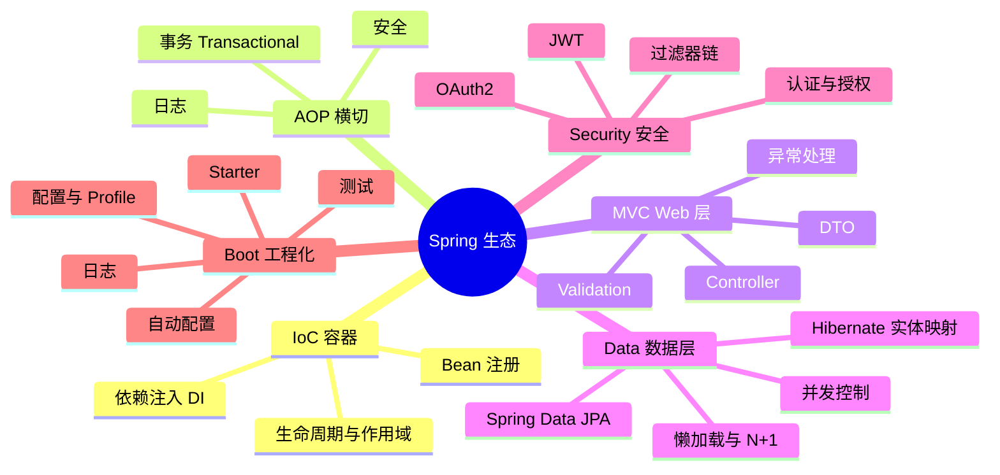

树的结构与依赖关系：

| Part | 一句话 | 它解决什么问题 | 学习顺序 |
|---|---|---|---|
| **Part 1 · IoC** | 容器统一管理对象和依赖 | 解耦、对象生命周期 | 1（根基） |
| **Part 2 · AOP** | 把横切逻辑（事务/日志/安全）织入业务代码 | 代码复用、无侵入 | 2 |
| **Part 3 · MVC** | Web 请求如何到达你的代码并返回响应 | 写 HTTP API | 3 |
| **Part 4 · Data** | 用接口和注解访问数据库，不手写 SQL | 数据持久化 | 4 |
| **Part 5 · Security** | 认证（你是谁）+ 授权（你能干什么） | 保护 API | 5 |
| **Part 6 · Boot** | 自动装配以上一切，开箱即用 | 减少配置、快速起步 | 6（外壳） |

> 阅读建议：Part 1、2 是底层机制，建议先读；Part 3、4、5 是三大支柱，顺序不限；Part 6 是外壳——其实你每天写的注解（`@Service`、`@RestController`、`JpaRepository`）大多属于前五个 Part，Boot 只负责把它们自动装起来（见 6.1 的"注解归属表"）。

### 0.2 项目结构速览

```text
backend/src/main/java/com/example/demo
├── DemoApplication.java          # 启动入口（@SpringBootApplication）
├── config/                       # 配置类：CorsConfig、PaymentProperties、SchedulingConfig…
├── common/                       # 通用：BusinessException、GlobalExceptionHandler、Money、IdGenerator
├── product/                      # 商品域：Product + ProductRepository + ProductService + ProductController
├── order/                        # 订单域：Order + OrderRepository + OrderService + OrderController
│   └── dto/                      # CreateOrderRequest / OrderResponse / OrderItemRequest
└── payment/                      # 支付域：PaymentRecord + PaymentService + PaymentController
    ├── gateway/                  # 渠道抽象：PaymentGateway 接口 + PaymentGatewayRegistry
    ├── alipay/ wechat/ card/     # 三个渠道的具体实现
    └── dto/                      # 支付相关 DTO
```

一句话总结分层职责：

| 层 | 职责 | 本项目的类 |
|---|---|---|
| Controller | 接收 HTTP 请求、解析参数、返回 HTTP 响应，**不做业务** | `OrderController` |
| Service | 业务逻辑、事务边界、编排其他服务 | `OrderService`、`ProductService` |
| Repository | 数据访问，屏蔽 SQL/JPA 细节 | `OrderRepository`、`ProductRepository` |
| Entity | 与数据库表一一对应的领域对象 | `Order`、`Product`、`PaymentRecord` |
| DTO | 网络传输格式（请求/响应），与 Entity 解耦 | `CreateOrderRequest`、`OrderResponse` |

> 对照关系：Controller 属于 **Part 3 (MVC)**，Service 是 Part 1 的 Bean + Part 2 的事务，Repository/Entity 属于 **Part 4 (Data)**，DTO/校验/异常属于 **Part 3 (MVC)**。

---

## Part 1: IoC（容器与对象管理）

```text
Part 1 路径：IoC（容器与对象管理）
├── 1.1 IoC 容器与依赖注入
│   ├── 为什么需要（new 的问题）
│   └── 容器 + DI 解决
├── 1.2 把类变成 Bean
│   ├── 注解声明（@Component/@Service/@Repository/@Controller/@Configuration）
│   └── 编程式声明（@Configuration + @Bean）
├── 1.3 构造器注入
│   └── 为什么推荐（final / 可用 / 可测 / 明确）
├── 1.4 高级技巧：注入一组 Bean
│   └── PaymentGatewayRegistry（策略 + 开闭原则）
└── 1.5 Bean 生命周期与作用域
```

### 1.1 IoC 容器与依赖注入

#### 1.1.1 问题：传统对象创建方式

传统写法里，一个类需要另一个类时，自己 `new`：

```java
public class OrderService {
    private OrderRepository orderRepository = new OrderRepository();
    private ProductService productService = new ProductService();
}
```

问题：
- 对象之间**强耦合**，难以替换实现（比如测试时换成 Mock）。
- 创建逻辑散落在各处，生命周期没人统一管理。

#### 1.1.2 解决：IoC 容器 + 依赖注入（DI）

Spring 的核心是一个 **IoC 容器（Inversion of Control，控制反转）**，也叫 `ApplicationContext`：

- **控制反转**：对象不再是"自己创建依赖"，而是由容器统一创建、管理、注入。
- **依赖注入（Dependency Injection, DI）**：容器把依赖"塞"给需要的对象。

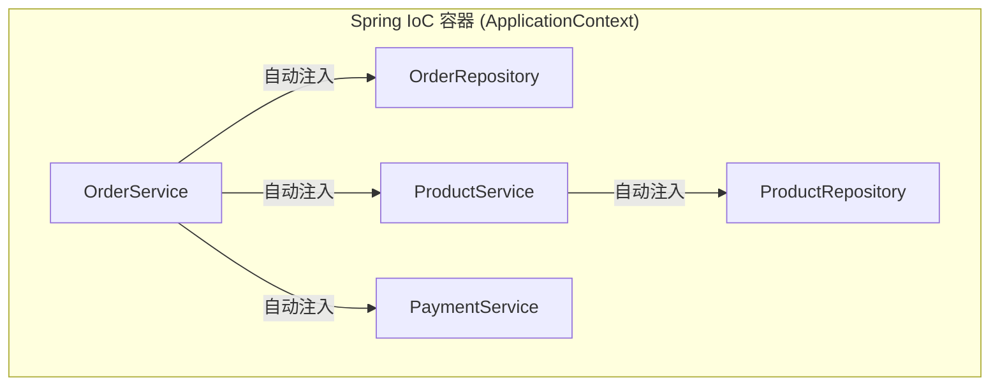

### 1.2 把类变成 Bean

#### 1.2.1 注解声明（stereotype 注解）

只要给类加上一个 **stereotype 注解**，Spring 启动时扫描到它，就会创建实例放入容器（默认单例）：

| 注解 | 含义 | 本项目例子 |
|---|---|---|
| `@Component` | 通用组件 | `PaymentGatewayRegistry` |
| `@Service` | 业务服务层 | `OrderService`、`ProductService` |
| `@Repository` | 数据访问层（还会翻译持久层异常） | `ProductRepository`（接口） |
| `@Controller` / `@RestController` | Web 控制器 | `OrderController` |
| `@Configuration` | 配置类（可以声明 `@Bean`） | `CorsConfig`、`SchedulingConfig` |

> 接口（如 `OrderRepository`）本身不是 Bean，但 Spring Data 会在运行时**自动生成它的实现**并注册为 Bean，所以可以放心注入（详见 Part 4）。

#### 1.2.2 编程式声明（`@Configuration` + `@Bean`）

当组件不是你自己写的类（第三方 SDK 客户端、`RestTemplate` 等）时，在配置类里手动声明：

```java
@Configuration
public class AlipayConfig {

    @Bean
    public AlipayClient alipayClient(AlipayProperties props) {   // 方法参数也会自动注入
        AlipayConfig config = new AlipayConfig();
        config.setAppId(props.appId());
        ...
        return new DefaultAlipayClient(config);
    }
}
```

> 规则：**自己项目里的类用 `@Component`/`@Service` 系列注解；第三方/需要复杂初始化的对象用 `@Configuration` + `@Bean`**。

### 1.3 构造器注入

本项目全部使用**构造器注入**——在构造器里接收依赖：

```java
// order/OrderService.java
private final OrderRepository orderRepository;
private final ProductService productService;
private final PaymentService paymentService;
private final PaymentProperties paymentProperties;

public OrderService(OrderRepository orderRepository, ProductService productService,
                    PaymentService paymentService, PaymentProperties paymentProperties) {
    this.orderRepository = orderRepository;
    this.productService = productService;
    this.paymentService = paymentService;
    this.paymentProperties = paymentProperties;
}
```

Spring Boot 4 / Spring Framework 6 之后，**类只有一个构造器时无需写 `@Autowired`**，容器会自动按参数类型查找并注入。

为什么推荐构造器注入：

| 优点 | 说明 |
|---|---|
| 不可变 | `final` 字段，实例化后依赖不能变 |
| 保证可用 | 对象创建时依赖必须齐备，不可能半初始化 |
| 好测试 | 单元测试时直接 `new OrderService(mockRepo, ...)` 即可，不需要 Spring |
| 明确依赖 | 看构造器签名就知道这个类需要什么 |

> 另外两种注入方式了解即可：字段注入（`@Autowired` 打在字段上）和 Setter 注入，都有缺陷（不可测试、可变、循环依赖容易掩盖问题），新代码不要用。

### 1.4 高级技巧：注入一组 Bean

`PaymentGatewayRegistry` 是个很漂亮的例子——它把容器中**所有 `PaymentGateway` 的实现**注入到一个 `List`，再按渠道建索引：

```java
// payment/gateway/PaymentGatewayRegistry.java
@Component
public class PaymentGatewayRegistry {

    private final Map<PaymentChannel, PaymentGateway> gateways = new EnumMap<>(PaymentChannel.class);

    public PaymentGatewayRegistry(List<PaymentGateway> implementations) {
        implementations.forEach(g -> gateways.put(g.channel(), g));
    }

    public PaymentGateway get(PaymentChannel channel) { ... }
}
```

`AlipayGateway`、`WechatGateway`、`CardGateway` 都是 `@Component`，实现了同一个 `PaymentGateway` 接口（`payment/gateway/PaymentGateway.java`）。业务代码只依赖接口，新增一个支付渠道 = 新增一个实现类，**不用改任何调用方**。这就是 DI 带来的"开闭原则"。

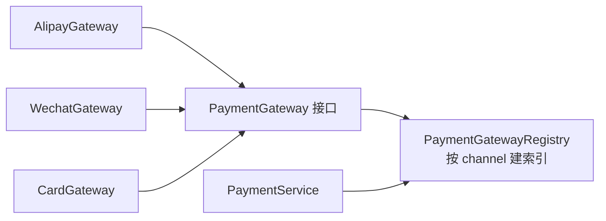

### 1.5 Bean 生命周期与作用域

| 概念 | 说明 |
|---|---|
| Bean | 由容器管理生命周期的对象 |
| `ApplicationContext` | IoC 容器本体，`SpringApplication.run()` 的返回值就是它 |
| Bean 作用域 | 默认 `singleton`（单例，整个应用一个实例）；还有 `prototype`（每次取都新建）、`request`、`session` |
| Bean 生命周期 | 实例化 → 依赖注入 → 初始化（`@PostConstruct`）→ 使用 → 销毁 |
| 循环依赖 | A 依赖 B、B 依赖 A；构造器注入下会启动失败——**应该重构**而不是解决它 |

```mermaid
flowchart LR
    I[实例化<br/>new] --> D[依赖注入<br/>构造器] --> P[初始化<br/>@PostConstruct] --> U[使用] --> X[销毁<br/>@PreDestroy]
```

---

## Part 2: AOP（横切机制）

```text
Part 2 路径：AOP（横切机制）
├── 2.1 AOP 是什么
│   └── 切面 / 切点 / 通知 / 代理
└── 2.2 事务 @Transactional（AOP 的典型应用）
    ├── 为什么需要（要么全成要么全滚）
    ├── 原理：代理 + AOP
    ├── 常见属性（回滚 / readOnly / 传播 / 隔离）
    ├── 传播行为（REQUIRED / 独立事务 / 每单一事务）
    └── 三个必踩的坑（自调用 / private / 检查异常）
```

### 2.1 AOP 是什么

**AOP（Aspect Oriented Programming，面向切面编程）**：把"横切逻辑"从业务代码里抽出来，在运行期织入。

典型横切逻辑：事务、日志、权限、性能统计——它们不属于任何单一业务，但每个业务方法都可能需要。

| 术语 | 含义 |
|---|---|
| 切面（Aspect） | 横切逻辑的模块（如"所有 `@Transactional` 方法"） |
| 切点（Pointcut） | 匹配哪些方法要织入（如"所有 Service 的 public 方法"） |
| 通知（Advice） | 织入的具体逻辑（前置/后置/环绕） |
| 代理（Proxy） | 运行时包在目标对象外的壳，负责拦截调用 |

> **你平时基本不直接写切面**，但三样东西全是 AOP：`@Transactional`（Part 2 的 2.2）、Spring Security 的 `@PreAuthorize`（Part 5）、`@Scheduled`（定时任务）。理解 AOP 之后，它们的原理就通了。

### 2.2 事务 @Transactional（AOP 的典型应用）

#### 2.2.1 为什么需要

`createOrder` 里做了多步写操作（扣库存 + 插订单 + 插明细），任何一个失败，前面成功的一半必须撤销，否则库存和订单对不上。`@Transactional` 保证：**要么全部成功提交，要么全部回滚**。

```java
@Transactional
public OrderResponse createOrder(CreateOrderRequest request) {
    ... productService.deductStock(...);   // ①
    orderRepository.save(order);           // ②
    // ③ 任一步抛异常 → ①②全部回滚
}
```

#### 2.2.2 原理：代理 + AOP

`@Transactional` 不是魔法，而是 **Spring AOP 代理**：

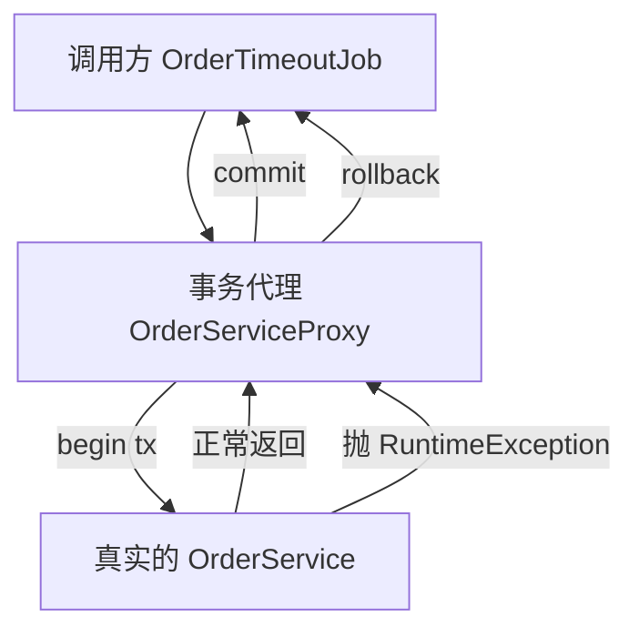

#### 2.2.3 常见属性

| 属性 | 说明 | 本项目使用 |
|---|---|---|
| 默认 | 遇到 `RuntimeException`/`Error` 回滚；**检查异常（Exception）默认不回滚** | — |
| `rollbackFor` | 显式指定哪些异常回滚 | 有调用外部渠道的场景可加 `@Transactional(rollbackFor = Exception.class)` |
| `readOnly = true` | 优化提示：只读事务，Hibernate 会跳过脏检查 | `listByUser`、`get` |
| `propagation` | 传播行为：`REQUIRED`（默认，加入已有事务）、`REQUIRES_NEW`（新事务） | 见 2.2.4 |
| `isolation` | 隔离级别：`READ_COMMITTED`（PG 默认）等 | 默认即可 |

#### 2.2.4 传播行为（Propagation）——本项目的重要设计

`OrderService.findExpiredPendingOrders` 的注释：

```java
/** Runs in its own transaction so the pessimistic locks on expired rows are acquired properly. */
@Transactional
public List<Order> findExpiredPendingOrders() { ... }
```

为什么"自己的事务"重要：`OrderTimeoutJob` 定时任务不在事务里调用（`@Scheduled` 方法没有事务），所以进入 `findExpiredPendingOrders` 时 `REQUIRED` 会**新建事务**，`PESSIMISTIC_WRITE` 锁 `SELECT ... FOR UPDATE` 才有意义（锁要持有到事务提交）。

再注意 `closeExpired` 里每单一个事务：`OrderTimeoutJob` 循环里逐个调 `closeExpired`，每单独立提交，一单失败不影响其他单。而 `createOrder` 内部调 `productService.deductStock()` 时，由于传播级别是 `REQUIRED`，**它们处于同一个事务**——这是 Service 层编排多个写操作的默认姿势。

#### 2.2.5 三个必踩的坑

| 坑 | 说明 | 规避 |
|---|---|---|
| **自调用失效** | 同一个类里 `this.methodB()` 调 `@Transactional` 方法，走的是 `this` 而不是代理，事务不生效 | 拆到另一个 Bean，或自己注入自己 |
| **private / final 方法** | 代理无法增强 | 事务方法必须 public，且类不要 final |
| **检查异常不回滚** | 默认只回滚 `RuntimeException` | 抛 `BusinessException`（继承 RuntimeException）天然满足；调外部网关时用 `rollbackFor` |

---

## Part 3: MVC（Web 层）

```text
Part 3 路径：MVC（Web 层）
├── 3.1 请求处理流程（DispatcherServlet → Controller → JSON）
├── 3.2 Controller（映射注解 / 参数 / 状态码 / 最佳实践）
├── 3.3 DTO（为什么要 DTO / 请求与响应 / 映射）
├── 3.4 Validation（约束注解 / @Valid 触发 / 嵌套校验）
└── 3.5 异常处理（BusinessException + GlobalExceptionHandler）
```

### 3.1 请求处理流程

- `@RestController` = `@Controller` + `@ResponseBody`：类里的方法返回值**自动用 Jackson 序列化成 JSON** 写入响应体。
- Controller 的职责：**解析请求 → 调 Service → 组装响应**，不写业务逻辑。

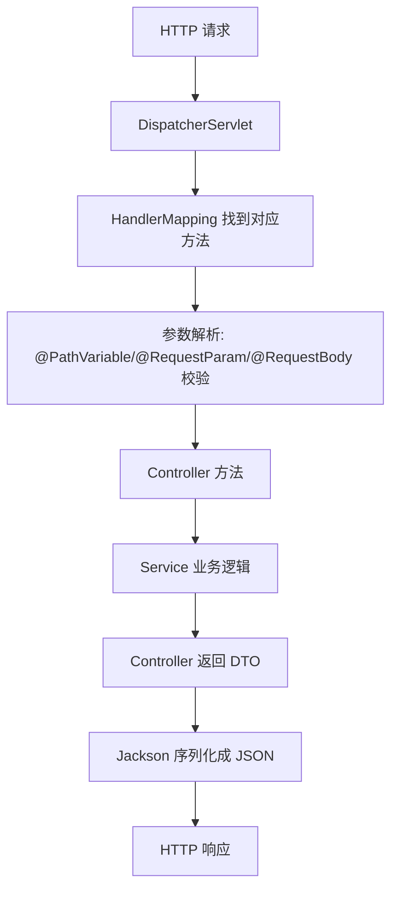

### 3.2 Controller

#### 3.2.1 看代码（`order/OrderController.java`）

```java
@RestController
@RequestMapping("/api/orders")      // 类级前缀，所有方法都挂在 /api/orders 下
public class OrderController {

    private final OrderService orderService;   // 只依赖 Service 接口行为

    public OrderController(OrderService orderService) {
        this.orderService = orderService;
    }

    @PostMapping
    @ResponseStatus(HttpStatus.CREATED)        // 显式声明 201，默认 POST 是 200
    public OrderResponse create(@Valid @RequestBody CreateOrderRequest request) {
        return orderService.createOrder(request);
    }

    @GetMapping("/{orderNo}")                  // 路径参数
    public OrderResponse get(@PathVariable String orderNo) {
        return orderService.get(orderNo);
    }

    @GetMapping
    public List<OrderResponse> list(@RequestParam Long userId) {  // 查询参数 ?userId=1
        return orderService.listByUser(userId);
    }

    @PostMapping("/{orderNo}/cancel")
    public OrderResponse cancel(@PathVariable String orderNo) {
        return orderService.cancel(orderNo);
    }
}
```

#### 3.2.2 常用注解速查

| 注解 | 作用 | 示例 |
|---|---|---|
| `@RequestMapping(path, method)` | 通用映射（类级 + 方法级） | `@RequestMapping("/api/orders")` |
| `@GetMapping/@PostMapping/@PutMapping/@DeleteMapping/@PatchMapping` | HTTP 方法快捷版 | `@GetMapping("/{orderNo}")` |
| `@PathVariable` | URL 路径变量 | `/orders/{orderNo}` → `orderNo` |
| `@RequestParam` | 查询参数 / 表单字段 | `?userId=1` |
| `@RequestBody` | 请求体 JSON → 对象 | 配合 `@Valid` 校验 |
| `@ResponseStatus` | 指定成功响应码 | `201 Created` |
| `@Valid` | 触发请求体 Bean Validation | `@Valid @RequestBody CreateOrderRequest` |

#### 3.2.3 最佳实践

- Controller **只做转发**：方法体通常一行 `return xxxService.xxx(...)`。
- 用**名词 + HTTP 方法**设计 REST：`POST /api/orders`（创建）、`POST /api/orders/{orderNo}/cancel`（动作用子资源）。
- 状态码要贴切：创建 201、成功 200、业务冲突 409（本项目 `BusinessException` 就是这么用的）。
- 响应体直接用 DTO，**绝不返回 Entity**（否则序列化可能泄露字段、或触发懒加载问题，见 4.6）。

### 3.3 DTO

#### 3.3.1 为什么要 DTO

| 不直接暴露 Entity 的原因 | 说明 |
|---|---|
| 字段泄露 | Entity 里可能有不想给前端的字段（内部 id、内部状态位） |
| 格式转换 | 数据库存"分"（`totalCents`），前端要"元"（`BigDecimal`）；数据库存 `Instant`，前端要字符串 |
| 解耦 | Entity 结构变化不影响 API 契约 |
| 安全 | 防止把 ORM 内部结构（懒加载代理等）序列化出去 |

#### 3.3.2 请求 DTO（`order/dto/CreateOrderRequest.java`）

```java
// Java 16+ record：不可变 + 自动生成构造器/访问器，天然适合 DTO
public record CreateOrderRequest(
        @NotNull Long userId,
        @NotEmpty List<@Valid OrderItemRequest> items) {
}
```

#### 3.3.3 响应 DTO（`order/dto/OrderResponse.java`）

```java
public record OrderResponse(
        String orderNo,
        Long userId,
        OrderStatus status,
        BigDecimal totalAmount,     // 对外是"元"，内部存"分"
        Instant expiresAt,
        Instant createdAt,
        Instant paidAt,
        Instant closedAt,
        String paymentNo,
        List<Item> items) {

    public record Item(Long productId, String productName, BigDecimal price,
                       int quantity, BigDecimal subtotal) {
    }

    /** Entity → DTO 的映射，集中在这里做（Money 分→元） */
    public static OrderResponse from(Order order, String paymentNo) {
        ...
        return new OrderResponse(order.getOrderNo(), ...,
                Money.centsToYuan(order.getTotalCents()), ...);
    }
}
```

要点：

- **映射逻辑集中**：`OrderResponse.from(order, ...)` 静态工厂，把 `totalCents`（long，分）转成 `totalAmount`（BigDecimal，元）。Controller / Service 不直接碰转换细节。
- **嵌套 DTO**：`Item` 是订单明细的快照（下单时的价格），从 `OrderItem` 拷贝过来，之后商品价格变了也不影响历史订单展示。
- record 自动生成 `equals/hashCode/toString`，做断言测试也方便。

#### 3.3.4 本项目 DTO 一览

| DTO | 用途 | 关键字段 |
|---|---|---|
| `CreateOrderRequest` | 创建订单请求 | `userId`、`items` |
| `OrderItemRequest` | 明细请求 | `productId`、`quantity`（1~99） |
| `OrderResponse` | 订单响应 | 状态、金额、时间戳、支付单号 |
| `PaymentCreateRequest` / `PaymentCreateResult` | 发起支付请求/结果 | 渠道、金额、渲染参数 |
| `CardRequest` | 模拟卡支付 | 卡号等模拟字段 |

### 3.4 Validation

#### 3.4.1 概念

Spring Boot 集成了 **Bean Validation（JSR-380）** 规范，实现是 Hibernate Validator。用注解声明约束，框架自动校验，不需要手写 if。

依赖：`spring-boot-starter-validation`（pom.xml 里已有）。

#### 3.4.2 常用约束注解

| 注解 | 校验内容 | 本项目使用位置 |
|---|---|---|
| `@NotNull` | 非 null | `CreateOrderRequest.userId`、`OrderItemRequest.productId` |
| `@NotEmpty` | 集合/字符串非空 | `CreateOrderRequest.items` |
| `@NotBlank` | 字符串非空且非空白 | （可用于商品名等） |
| `@Min/@Max` | 数值范围 | `OrderItemRequest.quantity`（1~99） |
| `@Size` | 长度范围 | 可用于字符串/集合 |
| `@Email` | 邮箱格式 | — |
| `@Pattern` | 正则 | — |

#### 3.4.3 触发方式：`@Valid`（关键）

只有打上 `@Valid` 的地方，校验才生效：

```java
// OrderController.java —— 请求体校验
@PostMapping
public OrderResponse create(@Valid @RequestBody CreateOrderRequest request) {
    return orderService.createOrder(request);
}

// 嵌套校验：List 里的每个元素也要校验，需要在泛型上写 @Valid
public record CreateOrderRequest(
        @NotNull Long userId,
        @NotEmpty List<@Valid OrderItemRequest> items) {   // ← 嵌套
}
```

流程：请求体反序列化成 `CreateOrderRequest` → 校验失败抛 `MethodArgumentNotValidException` → 被 `GlobalExceptionHandler` 接住转成统一错误 JSON（3.5）。

#### 3.4.4 校验失败时的返回

`GlobalExceptionHandler.handleValidation` 返回：

```json
{
  "code": "VALIDATION_ERROR",
  "message": "request validation failed",
  "fields": {
    "items[0].quantity": "must be greater than or equal to 1"
  }
}
```

#### 3.4.5 进阶

- **自定义校验注解**：组合 `@Constraint(validatedBy = ...)` + 实现 `ConstraintValidator`。比如本项目可以做一个 `@ValidOrderItemList` 校验"至少一个商品"。
- **分组校验**：`@Validated(Create.class)` / `@Validated(Update.class)`，同一个 DTO 在不同场景用不同约束。
- **`@Validated` 用于方法参数校验**：Controller 里非 `@RequestBody` 的参数（如 `@RequestParam`）可以用类级 `@Validated` + `@Min` 等触发 `ConstraintViolationException`。

### 3.5 异常处理

#### 3.5.1 目标

业务异常、参数异常、未知异常，全部统一成一个稳定的 JSON 结构，不让原始堆栈泄漏到客户端：

```json
{ "code": "ORDER_NOT_FOUND", "message": "order not found: X" }
```

#### 3.5.2 自定义业务异常（`common/BusinessException.java`）

```java
/** 携带 HTTP 状态码 + 机器可读错误码 + 人类可读消息 */
public class BusinessException extends RuntimeException {

    private final HttpStatus status;
    private final String code;

    public BusinessException(HttpStatus status, String code, String message) {
        super(message);
        this.status = status;
        this.code = code;
    }
    // getStatus() / getCode()
}
```

设计思路：

- 继承 `RuntimeException` → 不需要强制 try-catch，**事务自动回滚**（Part 2 的 2.2）。
- **三个信息各司其职**：
  - `status`：HTTP 状态码（404 / 409 / 400…），决定响应状态行；
  - `code`：机器可读错误码（前端判断用，不依赖中文消息）；
  - `message`：给人看的消息。
- 用法（`OrderService.require`）：

```java
private Order require(String orderNo) {
    return orderRepository.findByOrderNo(orderNo)
            .orElseThrow(() -> new BusinessException(HttpStatus.NOT_FOUND,
                    "ORDER_NOT_FOUND", "order not found: " + orderNo));
}
```

#### 3.5.3 全局处理器（`common/GlobalExceptionHandler.java`）

```java
@RestControllerAdvice   // 全局拦截所有 Controller 抛出的异常
public class GlobalExceptionHandler {

    // 业务异常 → 状态码 + 错误码 + 消息
    @ExceptionHandler(BusinessException.class)
    public ResponseEntity<Map<String, Object>> handleBusiness(BusinessException e) {
        Map<String, Object> body = new LinkedHashMap<>();
        body.put("code", e.getCode());
        body.put("message", e.getMessage());
        return ResponseEntity.status(e.getStatus()).body(body);
    }

    // 校验失败 → 400 + 字段级错误
    @ExceptionHandler(MethodArgumentNotValidException.class)
    public ResponseEntity<Map<String, Object>> handleValidation(MethodArgumentNotValidException e) {
        ...
        e.getBindingResult().getFieldErrors()
                .forEach(f -> fields.putIfAbsent(f.getField(), f.getDefaultMessage()));
        return ResponseEntity.badRequest().body(body);
    }

    // 请求体格式错误（JSON 解析失败）
    @ExceptionHandler(HttpMessageNotReadableException.class) { ... }

    // 参数类型不匹配（/orders/abc 但期望 Long）
    @ExceptionHandler(MethodArgumentTypeMismatchException.class) { ... }

    // 兜底：未知异常 → 500 + 记录堆栈日志（日志里打，响应里不打！）
    @ExceptionHandler(Exception.class)
    public ResponseEntity<Map<String, Object>> handleUnexpected(Exception e) {
        log.error("Unhandled exception", e);
        ...
        return ResponseEntity.status(HttpStatus.INTERNAL_SERVER_ERROR).body(body);
    }
}
```

#### 3.5.4 要点

| 点 | 说明 |
|---|---|
| `@RestControllerAdvice` | 全局拦截，等价于 `@ControllerAdvice` + `@ResponseBody` |
| `@ExceptionHandler` | 声明方法处理的异常类型；一个类可以有多个 |
| 匹配规则 | 优先最具体的异常类型；找不到就找父类，`Exception` 是兜底 |
| 安全 | **兜底 handler 把完整堆栈记日志，响应只给通用消息**，避免泄露内部信息 |
| 事务联动 | Service 抛 `BusinessException` → 事务自动回滚（见 2.2） |

---

## Part 4: Data（数据层）

```text
Part 4 路径：Data（数据层）
├── 4.1 JPA / Hibernate / Spring Data JPA 三者定位
├── 4.2 实体映射（@Entity / @Column / @Enumerated / 关联）
├── 4.3 Repository（派生查询 / @Query / @Modifying / @Lock）
├── 4.4 并发控制（原子 UPDATE / CAS 状态机 / 悲观锁）
├── 4.5 持久化上下文与实体生命周期
├── 4.6 懒加载与 N+1（open-in-view: false）
└── 4.7 数据层配置与分页（ddl-auto / SQL 日志 / Page）
```

### 4.1 JPA 与 Hibernate 的定位

| 层 | 是什么 | 做什么 |
|---|---|---|
| **JPA** | Java 持久化规范（标准接口和注解） | 定义 `@Entity`、`EntityManager`、JPQL 等标准 |
| **Hibernate** | JPA 的具体实现（ORM 引擎） | Java 对象 ↔ 数据库表的映射、SQL 生成、持久化上下文、懒加载、脏检查 |
| **Spring Data JPA** | 在 JPA 之上的数据访问抽象 | 你写接口，它自动生成实现（`JpaRepository`） |

三者关系：**Spring Data JPA 依赖 JPA 规范 → JPA 规范由 Hibernate 实现 → Hibernate 直接操作 JDBC**。

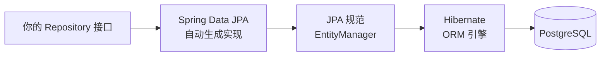

### 4.2 实体映射

#### 4.2.1 看代码（`order/Order.java`）

```java
@Entity                       // 这是 JPA 实体
@Table(name = "orders")       // 表名（Order 是 SQL 保留字，所以显式改名）
public class Order {

    @Id
    @GeneratedValue(strategy = GenerationType.IDENTITY)  // 数据库自增主键
    private Long id;

    @Column(nullable = false, unique = true, length = 40)  // 非空 + 唯一索引 + 长度
    private String orderNo;

    @Enumerated(EnumType.STRING)   // 枚举存字符串（可读、加枚举值不乱），而不是数字
    @Column(nullable = false, length = 30)
    private OrderStatus status = OrderStatus.PENDING_PAYMENT;

    @Column(nullable = false)
    private long totalCents;        // 金额一律用"分"（long），避免浮点误差

    @OneToMany(mappedBy = "order", cascade = CascadeType.ALL, orphanRemoval = true)
    private List<OrderItem> items = new ArrayList<>();   // 一对多关联

    protected Order() {
        // JPA 要求无参构造器（protected 即可），业务代码用带参构造器
    }
}
```

#### 4.2.2 关键概念

| 概念 | 说明 | 本项目体现 |
|---|---|---|
| `@Entity` + `@Table` | 类 ↔ 表 | `Order` → `orders` |
| `@Id` + `@GeneratedValue` | 主键生成策略 | `IDENTITY`（PG 自增） |
| `@Column` | 列约束（nullable/unique/length） | `orderNo` 唯一索引 |
| `@Enumerated(STRING)` | 枚举映射为字符串 | `OrderStatus` |
| `@OneToMany` | 关联映射 + 级联 | `Order.items`，`cascade=ALL, orphanRemoval=true` |
| 无参构造器 | JPA 反射重建对象需要 | `protected Order()` |
| 实体生命周期 | transient → managed → detached → removed | 由 `save`/事务提交驱动（见 4.5） |

### 4.3 Repository

#### 4.3.1 概念

`JpaRepository<T, ID>` 是 Spring Data JPA 提供的接口，**实现由 Spring 在运行时自动生成**。你只需要：

1. 声明接口继承 `JpaRepository<实体, 主键类型>`；
2. 写方法签名，Spring Data 按方法名**解析成查询**（派生查询）；
3. 复杂查询用 `@Query` 写 JPQL。

#### 4.3.2 接口继承体系

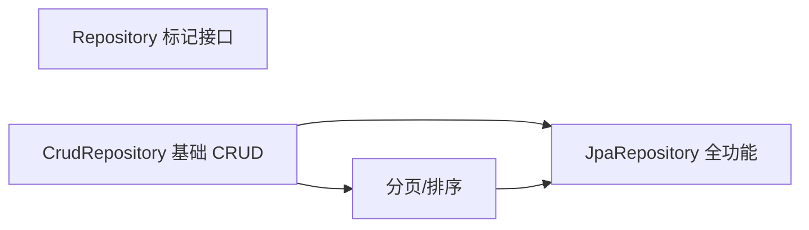

`JpaRepository<Order, Long>` 自带：`save`、`findById`、`findAll`、`delete`、`count`、`flush`、`findAll(Pageable)` 等。

#### 4.3.3 三种查询方式（`order/OrderRepository.java`，本项目全用到了）

```java
// ① 派生查询：按方法名自动生成
Optional<Order> findByOrderNo(String orderNo);
List<Order> findByUserIdOrderByCreatedAtDesc(Long userId);

// ② @Query JPQL：查询/更新/删除，@Param 绑定参数
@Modifying(clearAutomatically = true)
@Query("update Order o set o.status = :to, o.closedAt = :closedAt "
     + "where o.orderNo = :orderNo and o.status = :from")
int closeIfPending(@Param("orderNo") String orderNo, @Param("from") OrderStatus from,
                   @Param("to") OrderStatus to, @Param("closedAt") Instant closedAt);

// ③ @Lock 悲观锁查询（配合事务使用，见 4.4）
@Lock(LockModeType.PESSIMISTIC_WRITE)
@Query("select o from Order o where o.status = :status and o.expiresAt < :now")
List<Order> findExpiredPending(@Param("status") OrderStatus status, @Param("now") Instant now);
```

#### 4.3.4 派生查询命名速查

| 方法名模式 | 生成的 SQL 含义 |
|---|---|
| `findByOrderNo` | `WHERE order_no = ?` |
| `findByUserIdOrderByCreatedAtDesc` | `WHERE user_id = ? ORDER BY created_at DESC` |
| `findByStatusAndExpiresAtBefore` | `WHERE status = ? AND expires_at < ?` |
| `existsBy...` / `countBy...` | 存在性 / 计数 |
| `findFirst10By...` | 限量查询 |

### 4.4 并发控制

> 本项目是"订单 + 库存"系统，并发是核心问题。下面三个模式都值得背下来。

#### 4.4.1 原子 UPDATE（条件更新 / CAS）—— 防超卖

`product/ProductRepository.java` 里的扣库存是**最核心的一行代码**：

```java
// 一条 SQL 完成"检查库存足够 + 扣减"，数据库行级原子性保证并发不会超卖
@Modifying
@Query("update Product p set p.stock = p.stock - :qty where p.id = :id and p.stock >= :qty")
int deductStock(@Param("id") long id, @Param("qty") int qty);
```

关键点：

- **`where p.stock >= :qty`**：条件写在 SQL 里，两个并发请求同时执行时，数据库只让其中一个成功（受影响行数 = 1），另一个得到 0 行 → `ProductService.deductStock` 抛 `INSUFFICIENT_STOCK`。这就是"原子条件更新"（CAS）模式。
- 返回值是**受影响行数**，用它判断成功与否，而不是先查再改（先查再改有竞态）。
- `@Modifying(clearAutomatically = true)`：更新后清空持久化上下文的缓存，避免读到旧实体（详见 4.5）。

#### 4.4.2 状态机 CAS 迁移 —— 防止重复操作

`OrderRepository` 的 `closeIfPending` / `markPaidIfPending` 用"目标状态=旧状态"的条件更新，返回行数决定胜负：

```java
int rows = orderRepository.closeIfPending(orderNo, OrderStatus.PENDING_PAYMENT, OrderStatus.CLOSED, ...);
if (rows == 0) {
    throw new BusinessException(HttpStatus.CONFLICT, "ORDER_NOT_PENDING", "only pending orders can be cancelled");
}
```

- 只有"从期望状态"才能迁移到"目标状态"，天然幂等；
- 支付回调、用户取消、超时关单三个入口并发时，只有一个能赢，**赢的人负责回补库存**（见 `OrderService.markOrderPaid` / `closeExpired` 的 `rows == 1` 判断）。

#### 4.4.3 悲观锁 —— 先锁后查再改

```java
@Lock(LockModeType.PESSIMISTIC_WRITE)   // 事务内生成 SELECT ... FOR UPDATE
@Query("select o from Order o where o.status = :status and o.expiresAt < :now")
List<Order> findExpiredPending(...);
```

配合 `findExpiredPendingOrders` 的"自己的事务"（见 2.2.4），让超时扫描和支付回调串行化，避免"一边关单一边标记已支付"。

#### 4.4.4 三种方案对比

| 方案 | 原理 | 适用场景 | 本项目使用 |
|---|---|---|---|
| 原子 UPDATE 条件语句 | 单条 SQL 保证原子性 | 高频写、条件明确（扣库存） | ✅ `deductStock` |
| 乐观锁（`@Version`） | 版本号比较，失败重试 | 冲突少、可重试 | — |
| 悲观锁（`PESSIMISTIC_WRITE`） | `SELECT ... FOR UPDATE` 行锁 | 先锁后查再改、串行化 | ✅ `findExpiredPending` |

### 4.5 持久化上下文与实体生命周期

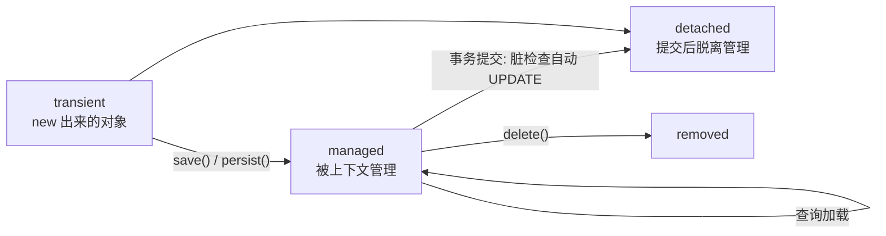

- **持久化上下文（Persistence Context）** = 一级缓存，一个事务一个。同一个 `findById` 两次返回**同一个实例**。
- **脏检查（Dirty Checking）**：事务提交时，Hibernate 对比 managed 实体的属性，自动生成 UPDATE——**修改实体字段后不需要手动调 `save`**。
- 这也是为什么 `@Modifying(clearAutomatically = true)` 很重要：绕过上下文直接发 SQL 后，如果不 clear，上下文里还是旧对象，脏检查可能把旧值写回去（覆盖你的 UPDATE）。

### 4.6 懒加载与 N+1

#### 4.6.1 问题

`Order.items` 是 `@OneToMany`，默认**懒加载（lazy）**：查 Order 时不查 items，只有访问 `order.getItems()` 才发第二条 SQL。

```java
List<Order> orders = orderRepository.findByUserIdOrderByCreatedAtDesc(userId);
for (Order o : orders) {
    o.getItems().size();   // ← 每访问一个 order 就发一条 SQL = N+1 查询
}
```

危害：循环里每行触发一次额外查询，列表 100 条 → 101 条 SQL。

#### 4.6.2 解决（按优先级）

1. **JOIN FETCH / @EntityGraph**：
   ```java
   @Query("select o from Order o left join fetch o.items where o.userId = :userId")
   List<Order> findByUserIdWithItems(Long userId);
   ```
2. **`@BatchSize`**：批量懒加载，减少为几条 SQL。
3. **DTO 投影**：只查需要的列，避免加载整个实体图。

#### 4.6.3 `open-in-view: false`（本项目已配置）

```yaml
spring:
  jpa:
    open-in-view: false   # application.yml 第 12 行
```

`open-in-view: true`（Boot 默认，但这是个反模式）会让 OSIV 过滤器在**整个 HTTP 请求期间**保持数据库连接和 Session 打开，Controller 里访问懒加载属性也能成功——代价是连接长时间占用、事务边界混乱、异常难排查。

本项目显式关了它，正确姿势是：**懒加载属性必须在事务内（Service 层）加载完**。本项目 `OrderResponse.from()` 在 Service 方法里调用（事务内），所以安全。

### 4.7 数据层配置与分页

#### 4.7.1 `@Modifying` 的坑（务必理解）

`@Modifying` 表示这是 **UPDATE/DELETE** 语句（默认查询返回结果会被 JPA 拒绝）。两个开关：

| 属性 | 作用 | 何时用 |
|---|---|---|
| `flushAutomatically = true` | 执行前先 flush 持久化上下文中的挂起变更 | 前置修改想参与本次 SQL |
| `clearAutomatically = true` | 执行后清空持久化上下文缓存 | **本项目使用**：避免下次 `findById` 拿到被 `@Modifying` 更新前的旧实体 |

本项目所有 CAS 更新都加了 `clearAutomatically = true`，因为更新后紧跟着会 `findById` / 再查同一实体（比如 `ProductService.adjustStock` 更新后立刻 `requireEntity(id)` 返回新库存）。

> 另一个常见坑：`@Modifying` 的 JPQL 更新**不会级联触发**实体的 `@Version` 乐观锁检查，也不会走生命周期回调（除非加 `@Versioned` 等）。本项目用 CAS 行数判断，绕开了这个问题。

#### 4.7.2 分页

```java
// 翻页
Page<Order> page = orderRepository.findByUserIdOrderByCreatedAtDesc(
        userId, PageRequest.of(0, 20, Sort.by("createdAt").descending()));
// Page 里有 getContent() / getTotalElements() / getTotalPages()
```

`Page` 对象还支持返回 `Slice`（只翻页不带总数，性能更好）。

#### 4.7.3 ddl-auto 与 SQL 日志

```yaml
spring:
  jpa:
    hibernate:
      ddl-auto: update     # 启动时自动建表/加列。开发方便，生产必须关闭（用 Flyway/Liquibase 管理 schema）
    properties:
      hibernate:
        format_sql: true   # 打印的 SQL 格式化
```

> `ddl-auto` 取值：`none`（不动）、`update`（增量）、`create`（每次重建）、`create-drop`（测试用）。生产环境应改成 `none` + 迁移工具。

---

## Part 5: Security（安全）

```text
Part 5 路径：Security（安全）
├── 5.1 认证 vs 授权
├── 5.2 过滤器链与接入配置
│   └── SecurityFilterChain / @PreAuthorize / 当前用户
├── 5.3 JWT
│   └── 结构 / 认证流程 / Access vs Refresh
└── 5.4 OAuth2
    └── 角色 / 授权码+PKCE / 方案对比
```

> 本项目**尚未引入** Spring Security（pom.xml 里没有对应 starter）。这一部分讲概念 + 引入后的写法，等你加认证时照着做。

### 5.1 认证与授权

- **认证（Authentication）**：你是谁？（登录验证）
- **授权（Authorization）**：你能干什么？（权限检查）

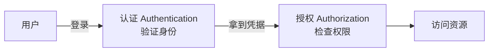

### 5.2 过滤器链与接入配置

#### 5.2.1 Filter Chain（过滤器链）

Spring Security 通过一组 Servlet Filter 拦截请求，依次做认证、授权、CSRF 等处理：

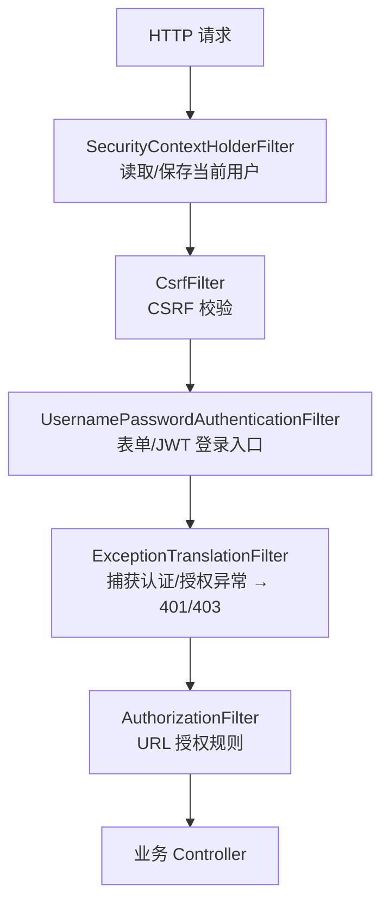

#### 5.2.2 最小配置（引入后的样子）

```java
@Configuration
@EnableWebSecurity
public class SecurityConfig {

    @Bean
    public SecurityFilterChain securityFilterChain(HttpSecurity http) throws Exception {
        http
            .csrf(csrf -> csrf.disable())               // 纯 JSON API + JWT 场景可关（浏览器表单场景别关！）
            .sessionManagement(sm -> sm.stateless())     // 无状态：不用 Session 存登录态
            .authorizeHttpRequests(auth -> auth
                .requestMatchers("/api/auth/**", "/api/payments/**/notify").permitAll()  // 登录接口、支付回调放行
                .requestMatchers("/api/**").authenticated()                              // 其余都要登录
                .anyRequest().permitAll())
            .addFilterBefore(new JwtAuthenticationFilter(...), UsernamePasswordAuthenticationFilter.class);
        return http.build();
    }

    @Bean
    public PasswordEncoder passwordEncoder() {
        return new BCryptPasswordEncoder();   // 密码必须 BCrypt 哈希，绝不明文存储
    }
}
```

#### 5.2.3 方法级安全（细粒度授权）

```java
@EnableMethodSecurity   // 加在任意 @Configuration 上

@Service
public class OrderService {

    @PreAuthorize("hasRole('ADMIN')")
    public OrderResponse refund(String orderNo) { ... }
}
```

#### 5.2.4 拿到当前用户

```java
// Controller 里
Authentication auth = SecurityContextHolder.getContext().getAuthentication();
String userId = auth.getName();   // 一般是 JWT 里的 subject
```

> 最佳实践：创建订单时**从认证信息取 userId**，不要信任客户端传来的 userId（本项目 `CreateOrderRequest.userId` 在无认证阶段由前端传入，加了 Security 后应改为从 token 取）。

#### 5.2.5 引入后你需要注意的几件事

1. **支付回调放行**：`/api/payments/alipay/notify`、`/wechat/notify` 是支付宝/微信服务器回调，走的是**渠道签名校验**（SDK 验证），不走 JWT，必须 `permitAll`。
2. **CORS 与 CSRF**：纯 JSON API 用 Bearer Token 时 CSRF 风险低可关；如果以后上 Cookie 会话就要保留 CSRF。
3. **密码存储**：`BCryptPasswordEncoder`（自动加盐）。
4. **密钥管理**：JWT 签名密钥从环境变量注入，不硬编码。

### 5.3 JWT

#### 5.3.1 结构

**JWT 是一个自包含的、签名的 JSON 令牌**，由三部分组成，用 `.` 分隔：

```
Header.Payload.Signature

Header  : {"alg":"HS256","typ":"JWT"}
Payload : {"sub":"42","role":"USER","exp":1737000000}   // 可读内容（base64，不是加密！）
Signature: HMAC-SHA256(base64(Header) + "." + base64(Payload), 密钥)
```

```mermaid
flowchart LR
    A[Header base64] --> S
    B[Payload base64] --> S
    S[签名 = HMAC(header.payload, 密钥)] --> T[Token]
```

#### 5.3.2 关键认知

| 点 | 说明 |
|---|---|
| 自包含 | Payload 里带用户信息，服务端不需要查库就知道是谁 |
| 签名 ≠ 加密 | Payload 只是 base64，**任何人都能解码看到内容**——绝不能放密码等敏感信息 |
| 两种签名算法 | `HS256`（对称：同一个密钥签名+验证，适合单服务）；`RS256`（非对称：私钥签、公钥验，适合多服务/第三方） |
| 无状态 | 服务端不存会话，适合分布式/微服务 |
| 最大缺点 | **无法主动吊销**——只能等 `exp` 过期。所以 token 有效期要短（如 15 分钟）+ 刷新机制 |

#### 5.3.3 基于 JWT 的认证流程（本项目未来可这样做）

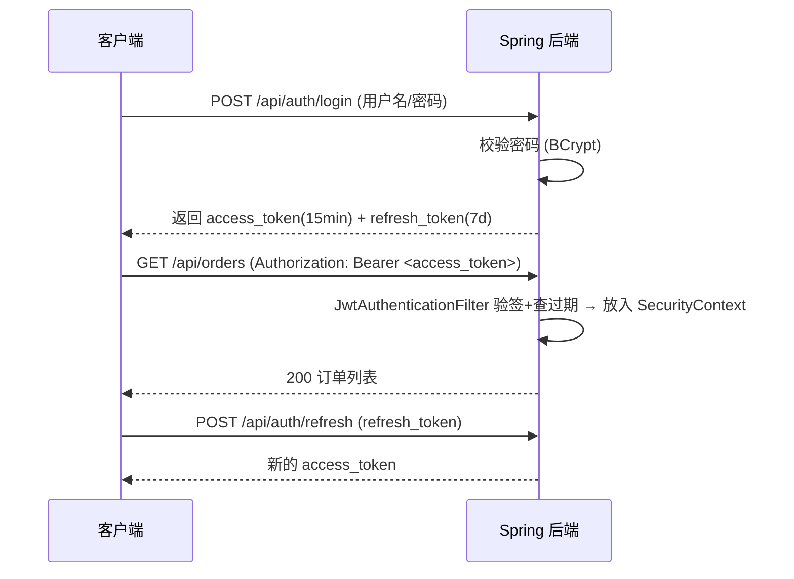

Spring 侧的核心组件：一个 `OncePerRequestFilter`（`JwtAuthenticationFilter`）负责解析 `Authorization: Bearer xxx` → 验签 → 构造 `Authentication` 放进 `SecurityContextHolder`，后续 Filter 和 `@PreAuthorize` 就能拿到用户。

#### 5.3.4 Access Token vs Refresh Token

| | Access Token | Refresh Token |
|---|---|---|
| 用途 | 访问 API | 换取新的 access token |
| 有效期 | 短（分钟级） | 长（天/周级） |
| 发送给资源服务器 | 是 | 否（只发给授权服务器） |
| 泄露风险 | 低（短命） | 高（可吊销名单 / 旋转） |

### 5.4 OAuth2

#### 5.4.1 概念与角色

OAuth2 解决的是**授权**问题："应用 A 能否代表用户访问资源 B"。角色：

| 角色 | 说明 | 例子 |
|---|---|---|
| Resource Owner | 资源所有者（用户） | 你 |
| Client | 请求访问资源的应用 | 你的前端 / 第三方 App |
| Authorization Server | 认证 + 发令牌 | 微信登录、Google、你自己的 auth 服务 |
| Resource Server | 持有资源、验证令牌 | 你的后端 API |

#### 5.4.2 常用流程

**① 授权码流程（Authorization Code + PKCE）**——第三方登录（"用微信登录"）：

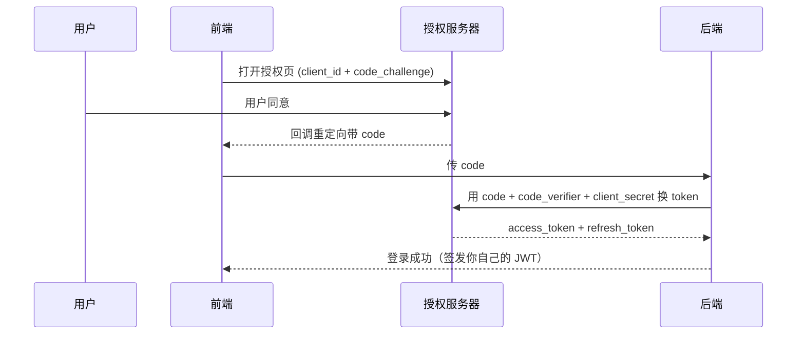

> PKCE（RFC 7636）：前端生成 `code_verifier`，传哈希 `code_challenge` 给授权服务器，防止 code 被截获重放。纯前端 SPA 必须用 PKCE。

**② 客户端凭证流程（Client Credentials）**——服务到服务（机器对机器），没有用户参与，`client_id + client_secret` 直接换 token。

#### 5.4.3 方案对比：什么时候用哪个

| 方案 | 特点 | 适用场景 |
|---|---|---|
| Session + Cookie | 简单、可随时吊销；需共享存储 | 单服务、传统 Web |
| JWT | 无状态、跨服务；不可吊销、Payload 可读 | 前后端分离、微服务 |
| Opaque Token（不透明令牌） | 服务端查库验证，可吊销；需要存储 | 强安全要求 |
| OAuth2 | 标准协议、第三方授权 | 第三方登录、开放 API |

> 常见组合：**自己系统的登录用「用户名密码 → 签发 JWT」；接第三方（微信/Google）用 OAuth2 授权码流程**，两者并不冲突。

---

## Part 6: Boot（工程化骨架）

```text
Part 6 路径：Boot（工程化骨架）
├── 6.1 Spring Boot 与自动配置（含注解归属表）
├── 6.2 入口类与 starter（@SpringBootApplication / pom.xml）
├── 6.3 配置与 Profile（@ConfigurationProperties / 环境变量）
├── 6.4 日志（SLF4J + Logback / 级别 / logback-spring.xml）
└── 6.5 测试（单元 / @WebMvcTest / @DataJpaTest / @SpringBootTest）
```

### 6.1 Spring Boot 与自动配置

#### 6.1.1 它解决了什么

Spring 本身配置繁琐（XML、各种 `@Enable*`）。Spring Boot 提供：

- **自动配置（Auto-configuration）**：根据 classpath 里的依赖（starter）自动装配。你加了 `spring-boot-starter-data-jpa`，它自动配好 `EntityManagerFactory`、`DataSource`；加了 `spring-boot-starter-webmvc`，自动内嵌 Tomcat 并配好 MVC。
- **Starter 依赖**：一个依赖聚合一组功能，见 `backend/pom.xml`。
- **内嵌服务器**：不需要装 Tomcat，`mvn spring-boot:run` 直接起。
- **外部化配置**：`application.yml` + 环境变量。

#### 6.1.2 Boot 与 Spring 的层次关系

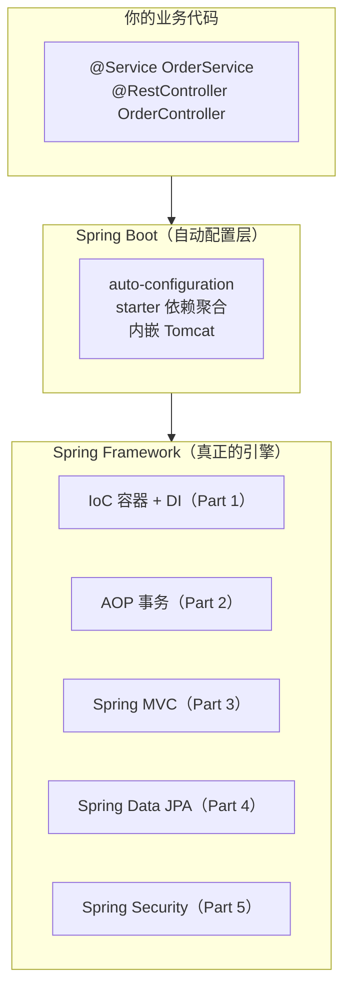

#### 6.1.3 注解归属表（哪些是 Spring 的，哪些是 Boot 的）

| 注解 | 属于谁 | 作用 | 文档位置 |
|---|---|---|---|
| `@Service`、`@Component` | **Spring Framework** | IoC 容器 | Part 1 |
| `@Transactional` | **Spring Framework（AOP）** | 事务 | Part 2 |
| `@RestController`、`@GetMapping` | **Spring MVC** | Web 层 | Part 3 |
| `JpaRepository`、`@Query` | **Spring Data JPA** | 数据访问 | Part 4 |
| `@PreAuthorize` | **Spring Security** | 方法授权 | Part 5 |
| `@SpringBootApplication` | **Spring Boot** | 开启自动配置 + 扫描 | 6.2 |
| `@ConfigurationProperties` | **Spring Boot** | 配置绑定 | 6.3 |

### 6.2 入口类与 starter

#### 6.2.1 入口类

```java
// DemoApplication.java
@SpringBootApplication
@ConfigurationPropertiesScan
public class DemoApplication {

    public static void main(String[] args) {
        SpringApplication.run(DemoApplication.class, args);
    }
}
```

`@SpringBootApplication` 是三个注解的组合：

| 注解 | 作用 |
|---|---|
| `@Configuration` | 这个类是配置类 |
| `@EnableAutoConfiguration` | 开启自动配置 |
| `@ComponentScan` | 扫描**当前包及子包**下所有 Bean（这就是为什么包必须放在 `com.example.demo` 下面） |

`@ConfigurationPropertiesScan` 会扫描所有 `@ConfigurationProperties` 类并注册为 Bean（见 6.3 的 `PaymentProperties`）。

#### 6.2.2 pom.xml 里的依赖（读一遍你的 pom）

```xml
<parent>
    <groupId>org.springframework.boot</groupId>
    <artifactId>spring-boot-starter-parent</artifactId>
    <version>4.1.0</version>   <!-- 版本集中管理，子依赖不用写版本号 -->
</parent>

<properties>
    <java.version>21</java.version>
</properties>

<!-- starter：JPA + 校验 + Web MVC -->
spring-boot-starter-data-jpa
spring-boot-starter-validation
spring-boot-starter-webmvc
<!-- 运行时驱动 -->
postgresql (runtime)
<!-- 业务 SDK：支付宝 / 微信支付 -->
alipay-sdk-java, wechatpay-java, gson
<!-- 测试 starter（Boot 4 按模块拆分了） -->
spring-boot-starter-data-jpa-test / validation-test / webmvc-test
```

> 注意 Spring Boot 4 的 starter 命名变化：`spring-boot-starter-web` → `spring-boot-starter-webmvc`；`spring-boot-starter-test` → 按模块拆分（`-test` 后缀的 starter）。

### 6.3 配置与 Profile

#### 6.3.1 配置来源与优先级

Spring Boot 配置优先级（高 → 低）：

```
命令行参数 > JVM 系统属性 > 环境变量 > application-{profile}.yml > application.yml
```

#### 6.3.2 类型安全的配置绑定：`@ConfigurationProperties`

```java
// config/PaymentProperties.java
@ConfigurationProperties(prefix = "payment")   // 绑定 payment.* 前缀
public record PaymentProperties(
        boolean simulationEnabled,
        int orderTimeoutMinutes,
        String returnUrl) {
}
```

对应的 `application.yml`：

```yaml
payment:
  simulation-enabled: true        # 大小写/连字符自动映射为 simulationEnabled
  order-timeout-minutes: 15
  return-url: ${PAYMENT_RETURN_URL:http://localhost:3000/orders}
```

用法（`OrderService` 里直接注入）：

```java
// 构造器注入即可使用
this.paymentProperties.orderTimeoutMinutes()  // 15
```

> 对比老的 `@Value("${payment.order-timeout-minutes}")`：`@ConfigurationProperties` 类型安全、集中、可校验（配合 `@Validated`），**新代码优先用它**。`DemoApplication` 上的 `@ConfigurationPropertiesScan` 负责扫描并注册这些类。

#### 6.3.3 环境变量与默认值

```yaml
alipay:
  app-id: ${ALIPAY_APP_ID:}                        # 无环境变量时为空字符串
  notify-url: ${ALIPAY_NOTIFY_URL:http://localhost:8080/...}   # 有默认值
```

**敏感信息（密钥、密码）绝不放 yml 明文**，一律 `${ENV_VAR}` 引用（本项目支付宝/微信密钥全部如此）。

#### 6.3.4 Profile（环境隔离）

不同环境（本地/测试/生产）用不同 profile。示例：

```yaml
# application.yml（公共）
spring:
  profiles:
    active: dev          # 默认激活 dev
  jpa:
    open-in-view: false

# application-dev.yml（开发：本地 PG，ddl-auto=update）
spring:
  datasource:
    url: jdbc:postgresql://localhost:5432/demo
  jpa:
    hibernate:
      ddl-auto: update

# application-prod.yml（生产：外部数据库，ddl-auto=none）
spring:
  datasource:
    url: ${DB_URL}
  jpa:
    hibernate:
      ddl-auto: none
```

启动方式：`java -jar demo.jar --spring.profiles.active=prod`，或用环境变量 `SPRING_PROFILES_ACTIVE=prod`。

也可以用 `@Profile("dev")` 让某个 Bean 只在特定 profile 存在（例如只在 dev 提供模拟支付通道）。

### 6.4 日志

#### 6.4.1 规范：SLF4J 门面 + Logback 实现

- **SLF4J** 是门面 API：代码里只写 `LoggerFactory.getLogger(...)`，具体实现（Logback）由 Boot 默认提供。
- Spring Boot 默认就配好了 Logback，**不需要任何额外依赖**。

#### 6.4.2 用法（本项目的写法）

```java
// order/OrderService.java
private static final Logger log = LoggerFactory.getLogger(OrderService.class);

log.info("order {} created for user {} ({} cents)", order.getOrderNo(), request.userId(), totalCents);
```

关键点：

- **用占位符 `{}` 传参**，不要用字符串拼接——日志级别不输出时零开销。
- 一个类一个 Logger，命名跟着类走（Logback 按类名决定输出）。
- 加 `private static final`。

#### 6.4.3 级别与场景

| 级别 | 用途 | 本项目例子 |
|---|---|---|
| `TRACE` / `DEBUG` | 调试细节（SQL 参数、中间值），默认关闭 | — |
| `INFO` | 关键业务事件（可审计） | 订单创建、取消、关闭、退款 |
| `WARN` | 异常但可恢复 | 模拟支付降级等 |
| `ERROR` | 必须有人处理的失败 | `OrderTimeoutJob` 单订单关闭失败 |

#### 6.4.4 日志配置（logback-spring.xml 示例）

```xml
<?xml version="1.0" encoding="UTF-8"?>
<configuration>
    <!-- 控制台：开发看 -->
    <appender name="CONSOLE" class="ch.qos.logback.core.ConsoleAppender">
        <encoder>
            <pattern>%d{yyyy-MM-dd HH:mm:ss.SSS} %-5level [%thread] %logger{36} - %msg%n</pattern>
        </encoder>
    </appender>

    <!-- 滚动文件：生产收集 -->
    <appender name="FILE" class="ch.qos.logback.core.rolling.RollingFileAppender">
        <file>logs/demo.log</file>
        <rollingPolicy class="ch.qos.logback.core.rolling.TimeBasedRollingPolicy">
            <fileNamePattern>logs/demo.%d{yyyy-MM-dd}.log.gz</fileNamePattern>
            <maxHistory>30</maxHistory>
        </rollingPolicy>
        <encoder>
            <pattern>%d{yyyy-MM-dd HH:mm:ss.SSS} %-5level [%thread] %logger{36} - %msg%n</pattern>
        </encoder>
    </appender>

    <root level="INFO">
        <appender-ref ref="CONSOLE"/>
        <appender-ref ref="FILE"/>
    </root>
</configuration>
```

按包调级别：

```yaml
logging:
  level:
    root: INFO
    com.example.demo.order: DEBUG      # 某个包开 DEBUG
    org.hibernate.SQL: INFO            # 打印 Hibernate 的 SQL（开发调优用）
```

#### 6.4.5 最佳实践

- **记"发生了什么 + 关键标识"**：订单日志一定带 `orderNo`、用户日志带 `userId`，否则没法追踪。
- **异常完整栈用 `log.error("...", e)`**（第二个参数传异常对象），不要只 `e.getMessage()`。
- 日志里**不要打敏感信息**（密钥、完整卡号、密码）。
- 生产日志最好**结构化**（JSON 输出），方便 ELK/Loki 检索：

```yaml
logging:
  pattern:
    console: '{"ts":"%d{yyyy-MM-dd HH:mm:ss.SSS}","level":"%-5level","logger":"%logger{36}","msg":"%msg"}%n'
```

### 6.5 测试

#### 6.5.1 测试金字塔与本项目对应

```mermaid
flowchart TB
    A[单元测试<br/>不启动 Spring, Mock 依赖<br/>数量多、速度快] --> B[切片测试<br/>@WebMvcTest / @DataJpaTest<br/>只加载一层] --> C[集成测试<br/>@SpringBootTest + 真实/容器化 DB<br/>数量少、覆盖完整链路]
```

| 类型 | 启动范围 | 速度 | 用途 |
|---|---|---|---|
| 单元测试 | 不启动 Spring | 极快 | Service 逻辑，依赖用 Mockito mock |
| `@WebMvcTest` | 只加载 Controller 层 | 快 | 路由、参数绑定、序列化、校验 |
| `@DataJpaTest` | 只加载 JPA 层 | 较快（内存库） | Repository 查询、映射 |
| `@SpringBootTest` | 全量上下文 | 慢 | 端到端链路、配置正确性 |

#### 6.5.2 单元测试：Service（Mockito）

```java
class OrderServiceTest {

    private OrderRepository orderRepository;   // mock
    private ProductService productService;     // mock
    private OrderService orderService;

    @BeforeEach
    void setUp() {
        orderRepository = mock(OrderRepository.class);
        productService = mock(ProductService.class);
        PaymentService paymentService = mock(PaymentService.class);
        PaymentProperties props = new PaymentProperties(true, 15, "http://localhost:3000/orders");
        orderService = new OrderService(orderRepository, productService, paymentService, props);
    }

    @Test
    void createOrder_deductsStockAndSaves() {
        // given：商品在售
        Product product = new Product("T恤", 9900L, 10);
        when(productService.requireEntity(1L)).thenReturn(product);

        // when
        OrderResponse response = orderService.createOrder(
                new CreateOrderRequest(42L, List.of(new OrderItemRequest(1L, 2))));

        // then
        verify(productService).deductStock(1L, 2);
        verify(orderRepository).save(any(Order.class));
        assertThat(response.totalAmount()).isEqualByComparingTo("198.00");
    }

    @Test
    void createOrder_rejectsOffSaleProduct() {
        Product product = new Product("已下架", 9900L, 10);
        product.setStatus(ProductStatus.OFF_SALE);
        when(productService.requireEntity(1L)).thenReturn(product);

        assertThatThrownBy(() -> orderService.createOrder(
                new CreateOrderRequest(42L, List.of(new OrderItemRequest(1L, 1)))))
                .isInstanceOf(BusinessException.class)
                .hasFieldOrPropertyWithValue("code", "NOT_ON_SALE");
    }
}
```

依赖：`org.mockito`（Boot 自带）、`assertj`。

#### 6.5.3 切片测试：`@WebMvcTest`

只加载 MVC 层（Controller + 过滤器 + 异常处理器），Service 用 mock 替换：

```java
@WebMvcTest(OrderController.class)
class OrderControllerTest {

    @Autowired
    MockMvc mockMvc;

    @MockitoBean          // Boot 4 / Spring Framework 6.2+ 新写法（替代 @MockBean）
    OrderService orderService;

    @Test
    void create_validatesBody() throws Exception {
        mockMvc.perform(post("/api/orders")
                        .contentType(MediaType.APPLICATION_JSON)
                        .content("""
                                {"userId": null, "items": []}
                                """))
                .andExpect(status().isBadRequest())
                .andExpect(jsonPath("$.code").value("VALIDATION_ERROR"))
                .andExpect(jsonPath("$.fields.userId").exists());
    }

    @Test
    void get_returnsOrder() throws Exception {
        when(orderService.get("NO-1")).thenReturn(someOrderResponse());

        mockMvc.perform(get("/api/orders/NO-1"))
                .andExpect(status().isOk())
                .andExpect(jsonPath("$.orderNo").value("NO-1"));
    }
}
```

#### 6.5.4 切片测试：`@DataJpaTest`

只加载 JPA 层（实体映射 + Repository 实现），默认事务回滚、默认内存库：

```java
@DataJpaTest
class OrderRepositoryTest {

    @Autowired
    OrderRepository orderRepository;

    @Test
    void closeIfPending_onlyTransitionsFromExpectedStatus() {
        Order order = new Order(1L, 100L, 15);
        orderRepository.save(order);

        int won = orderRepository.closeIfPending(order.getOrderNo(),
                OrderStatus.PENDING_PAYMENT, OrderStatus.CLOSED, Instant.now());

        assertThat(won).isEqualTo(1);
        // 再来一次：状态已不是 PENDING_PAYMENT → 0 行，幂等
        int again = orderRepository.closeIfPending(order.getOrderNo(),
                OrderStatus.PENDING_PAYMENT, OrderStatus.CLOSED, Instant.now());
        assertThat(again).isEqualTo(0);
    }
}
```

#### 6.5.5 集成测试：`@SpringBootTest` + Testcontainers

```java
@SpringBootTest
@AutoConfigureMockMvc
class OrderFlowIntegrationTest {

    @Autowired
    MockMvc mockMvc;
}
```

数据库选择：

| 方案 | 优点 | 缺点 |
|---|---|---|
| H2（内存） | 快、零配置 | SQL 方言与 PG 有差异（如 `FOR UPDATE`、类型），可能"测试过了生产炸了" |
| **Testcontainers（跑真实 PG）** | 和线上一致 | 需要 Docker，稍慢 |

本项目用 PostgreSQL 专有行为（`FOR UPDATE`、条件更新），**强烈建议 Testcontainers 跑真实 PG**。

#### 6.5.6 本项目测试相关

pom.xml 已引入测试 starter（`spring-boot-starter-data-jpa-test` / `validation-test` / `webmvc-test`），`src/test` 目录已建好但还没有测试类——正好可以作为你练习写测试的起点。

---

## 附录

### A. 建议学习路线

按顺序，学完每章做一个小练习，都能在本项目里落地：

1. **IoC（Part 1）**：新建一个 `@Service`（比如 `DiscountService`），在 `OrderService` 里注入它。
2. **Controller（3.2）**：给 `OrderController` 加一个 `GET /api/orders/{orderNo}/items` 接口。
3. **Validation（3.4）**：给 `CreateOrderRequest` 加"商品数量至少 1 件"的校验，写个测试看 400。
4. **异常处理（3.5）**：给 `GlobalExceptionHandler` 加一个专门处理"商品不存在"的 handler。
5. **Repository / JPA / Hibernate（Part 4）**：给 `OrderRepository` 加一个 `findByStatus` 派生查询；写 `@DataJpaTest`。
6. **事务（2.2）**：手动在 `createOrder` 里抛异常，观察库存和订单一起回滚。
7. **配置（6.3）**：把 `payment.order-timeout-minutes` 改成 profile 化（dev=15，prod=30）。
8. **日志（6.4）**：用 `log.warn` 记录"库存不足"事件，配置 `logback-spring.xml` 输出到文件。
9. **测试（6.5）**：给 `OrderService` 写完整单元测试（`mvn test`）。
10. **Security + JWT（Part 5）**：引入 `spring-boot-starter-security`，实现登录接口 + JWT 过滤器（参考 5.2、5.3）。

最终验证：`./mvnw test` 全部通过，`./mvnw spring-boot:run` 正常启动，`curl` 走一遍"下单 → 模拟支付 → 查单"。

### B. 参考文件索引

| 主题 | 本项目中对照阅读的文件 |
|---|---|
| 启动入口 | `backend/src/main/java/com/example/demo/DemoApplication.java` |
| 依赖管理 | `backend/pom.xml` |
| 配置 | `backend/src/main/resources/application.yml`、`backend/src/main/java/com/example/demo/config/*.java` |
| Controller | `backend/src/main/java/com/example/demo/order/OrderController.java`、`payment/PaymentController.java`、`product/ProductController.java` |
| Service | `backend/src/main/java/com/example/demo/order/OrderService.java`、`product/ProductService.java`、`payment/PaymentService.java` |
| Repository | `backend/src/main/java/com/example/demo/order/OrderRepository.java`、`product/ProductRepository.java`、`payment/PaymentRepository.java` |
| Entity | `backend/src/main/java/com/example/demo/order/Order.java`、`OrderItem.java`、`product/Product.java`、`payment/PaymentRecord.java` |
| DTO | `backend/src/main/java/com/example/demo/order/dto/*.java`、`payment/dto/*.java` |
| 校验 | `backend/src/main/java/com/example/demo/order/dto/CreateOrderRequest.java`、`OrderItemRequest.java` |
| 异常 | `backend/src/main/java/com/example/demo/common/BusinessException.java`、`GlobalExceptionHandler.java` |
| 设计模式 | `backend/src/main/java/com/example/demo/payment/gateway/PaymentGateway.java`（策略/适配器 + DI） |
| 定时任务 | `backend/src/main/java/com/example/demo/order/OrderTimeoutJob.java`、`config/SchedulingConfig.java` |
| 系统设计文档 | `docs/design.md`（整个项目的架构、数据模型、状态机、并发方案） |
